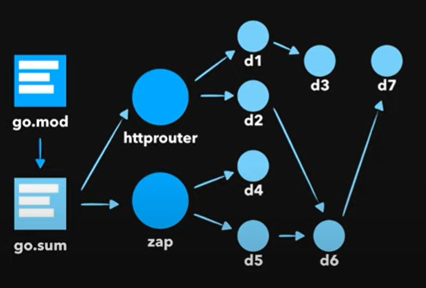

# Intro

A module is a collection of Go packages stored in a file tree with a go.mod file at its root.

The go.mod file defines the module’s module path, which is also the import path used for the root directory, and its dependency requirements, which are the other modules needed for a successful build. Each dependency requirement is written as a module path and a specific semantic version.

> As of Go 1.11, the go command enables the use of modules when the current directory or any parent directory has a go.mod, provided the directory is outside $GOPATH/src. (Inside $GOPATH/src, for compatibility, the go command still runs in the old GOPATH mode, even if a go.mod is found. 

## Links

* https://blog.golang.org/using-go-modules
* https://golang.org/doc/tutorial/create-module

# Example

```
go mod init github.com/lairtonb/go-modules
```

The go.mod file is created:

```
module github.com/lairtonb/go-modules

go 1.15
```

With this command:

```
go get rsc.io/quote
```

The go.mod file is then updated:

```
module github.com/lairtonb/go-modules

go 1.15

require rsc.io/quote v1.5.2
```

And go.sum is also created:

```
golang.org/x/text v0.0.0-20170915032832-14c0d48ead0c h1:qgOY6WgZOaTkIIMiVjBQcw93ERBE4m30iBm00nkL0i8=
golang.org/x/text v0.0.0-20170915032832-14c0d48ead0c/go.mod h1:NqM8EUOU14njkJ3fqMW+pc6Ldnwhi/IjpwHt7yyuwOQ=
rsc.io/quote v1.5.2 h1:w5fcysjrx7yqtD/aO+QwRjYZOKnaM9Uh2b40tElTs3Y=
rsc.io/quote v1.5.2/go.mod h1:LzX7hefJvL54yjefDEDHNONDjII0t9xZLPXsUe+TKr0=
rsc.io/sampler v1.3.0 h1:7uVkIFmeBqHfdjD+gZwtXXI+RODJ2Wc4O7MPEh/QiW4=
rsc.io/sampler v1.3.0/go.mod h1:T1hPZKmBbMNahiBKFy5HrXp6adAjACjK9JXDnKaTXpA=
```

These two files are then used to resolve dependencies:



# Restore

Download all packages after clone, checking very source file:

```
go get ./...
```

This one downloads only deps listed in go mod:

```
go mod download
```

# Also See

To clean go.mod:

```
go mod tidy
```

# Clean cache

```
go clean -cache -modcache -i -r
```

# Restore Vendor Deps

To restore vendor deps that don't support modules:

```
go mod vendor
```

This creates a vendor folder for imports.

# See Module Versions

```
go list -m -versions rsc.io/quote
```

Outputs

```
rsc.io/quote v1.0.0 v1.1.0 v1.2.0 v1.2.1 v1.3.0 v1.4.0 v1.5.0 v1.5.1 v1.5.2 v1.5.3-pre1
```

Note the it does not list any major versions 2 or above though!?!

# GOPROXY and GOSUMDB

[TODO] look-up the docs

